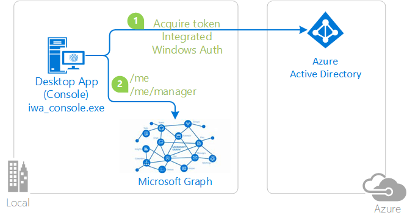

# Invoking an API protected by Microsoft identity platform with Integrated Windows Authentication, on a Windows domain joined or AAD joined machine
[](https://identitydivision.visualstudio.com/IDDP/_build/latest?definitionId=692)

## About this sample

### Overview

This sample demonstrates how to use MSAL.NET from apps that run on a domain joined or AAD joined Windows machine. It enables these apps to:

- authenticate the user signed-in on the Windows machine
- and call to a web API (in this case, the [Microsoft Graph](https://graph.microsoft.com))



If you would like to get started immediately, skip this section and jump to *How To Run The Sample*.

### Scenario

The application obtains tokens through Integrated Windows Authentication (Kerberos):

- Developers who wish to gain good familiarity of programming for Microsoft Graph are advised to go through the [An introduction to Microsoft Graph for developers](https://www.youtube.com/watch?v=EBbnpFdB92A) recorded session. 

## How to run this sample

To run this sample, you'll need:

- [Visual Studio 2017](https://aka.ms/vsdownload)
- An Internet connection
- An Azure Active Directory (Azure AD) tenant. For more information on how to get an Azure AD tenant, see [How to get an Azure AD tenant](https://azure.microsoft.com/documentation/articles/active-directory-howto-tenant/)
- A user account in your Azure AD tenant. This sample will not work with a Microsoft account (formerly Windows Live account). Therefore, if you signed in to the [Azure portal](https://portal.azure.com) with a Microsoft account and have never created a user account in your directory before, you need to do that now.

### Step 1: Clone or download this repository

From your shell or command line:

```Shell
git clone https://github.com/Azure-Samples/active-directory-dotnet-iwa-v2.git
```

or download and exact the repository .zip file.

> Given that the name of the sample is pretty long, and so are the name of the referenced NuGet pacakges, you might want to clone it in a folder close to the root of your hard drive, to avoid file size limitations on Windows.

### Step 2: Run the sample

Open the solution in Visual Studio, restore the NuGet packages, select the project, and start it in the debugger.

#### Operating the sample

When you run the sample, if you are running on a domain joined or AAD joined Windows machine, it will display your information as well as the information about your manager.

### Step 2:(Optional): Configure the sample as an app in your directory tenant

The instructions so far used the Azure AD entry for the app in a Microsoft test tenant: given that the app is multi-tenant, anybody can run the sample against that app registration.
To register your project in your own Azure AD tenant, you can find instructions to manually provision the sample in your own tenant, so that you can exercise complete control on the app settings and behavior.

There is one project in this sample. To register it, you can:

- either follow the steps [Step 2: Register the sample with your Azure Active Directory tenant](#step-2-register-the-sample-with-your-azure-active-directory-tenant) and [Step 3:  Configure the sample to use your Azure AD tenant](#choose-the-azure-ad-tenant-where-you-want-to-create-your-applications)
- or use PowerShell scripts that:
  - **automatically** creates the Azure AD applications and related objects (passwords, permissions, dependencies) for you
  - modify the Visual Studio projects' configuration files.

If you want to use this automation:
1. On Windows run PowerShell and navigate to the root of the cloned directory
1. In PowerShell run:
   ```PowerShell
   Set-ExecutionPolicy -ExecutionPolicy RemoteSigned -Scope Process -Force
   ```
1. Run the script to create your Azure AD application and configure the code of the sample application accordingly. 
   ```PowerShell
   .\AppCreationScripts\Configure.ps1
   ```
   > Other ways of running the scripts are described in [App Creation Scripts](./AppCreationScripts/AppCreationScripts.md)

1. Open the Visual Studio solution and click start

If you don't want to use this automation, follow the steps below

#### Choose the Azure AD tenant where you want to create your applications

As a first step you'll need to:

1. Sign in to the [Azure portal](https://portal.azure.com) using either a work or school account or a personal Microsoft account.
1. If your account is present in more than one Azure AD tenant, select `Directory + Subscription` at the top right corner in the menu on top of the page, and switch your portal session to the desired Azure AD tenant.   
1. In the left-hand navigation pane, select the **Azure Active Directory** service, and then select **App registrations**.

#### Register the client app (iwa-console)

1. In **App registrations (Preview)** page, select **New registration**.
1. When the **Register an application page** appears, enter your application's registration information:
   - In the **Name** section, enter a meaningful application name that will be displayed to users of the app, for example `iwa-console`.
   - In the **Supported account types** section, select **Accounts in any organizational directory**.
   - Select **Register** to create the application.
1. On the app **Overview** page, find the **Application (client) ID** value and record it for later. You'll need it to configure the Visual Studio configuration file for this project.
1. In the list of pages for the app, select **Manifest**, and:
   - In the manifest editor, set the ``allowPublicClient`` property to **true** 
   - Select **Save** in the bar above the manifest editor.
1. In the list of pages for the app, select **API permissions**
   - Click the **Add a permission** button and then,
   - Ensure that the **Microsoft APIs** tab is selected
   - In the *Commonly used Microsoft APIs* section, click on **Microsoft Graph**
   - In the **Delegated permissions** section, ensure that the right permissions are checked: **User.Read**, **User.ReadBasic.All**. Use the search box if necessary.
   - Select the **Add permissions** button

1. At this stage permissions are assigned correctly but the client app does not allow interaction. 
   Therefore no consent can be presented via a UI and accepted to use the service app. 
   Click the **Grant/revoke admin consent for {tenant}** button, and then select **Yes** when you are asked if you want to grant consent for the
   requested permissions for all account in the tenant.
   You need to be an Azure AD tenant admin to do this.

### Step 3:  Configure the sample to use your Azure AD tenant

In the steps below, "ClientID" is the same as "Application ID" or "AppId".

Open the solution in Visual Studio to configure the projects

#### Configure the client project

> Note: if you used the setup scripts, the changes below will have been applied for you

1. Open the `iwa-console\appsettings.json` file
1. Find the line where `clientId` is set and replace the existing value with the application ID (clientId) of the `iwa-console` application copied from the Azure portal.
1. [optionally] Find the line where `Tenant` is set and replace the existing value with your tenant ID.

Clean the solution, rebuild the solution, and start it in the debugger.

## About the code

The code for handling the token acquisition process is simple, as it boils down to calling the `AcquireTokenByIntegratedWindowsAuthAsync` method of `PublicClientApplication`. See the `GetTokenForWebApiUsingIntegratedWindowsAuthenticationAsync` method in `PublicAppUsingIntegratedWindowsAuthentication.cs`.

```CSharp
private async Task<AuthenticationResult> GetTokenForWebApiUsingIntegratedWindowsAuthenticationAsync(IEnumerable<string> scopes)
{
    AuthenticationResult result=null;
    try
    {
        result = await App.AcquireTokenByIntegratedWindowsAuthAsync(scopes);
    }
    catch() 
        ...
        // error handling omitted here (see sample for details)
```

## Community Help and Support

Use [Stack Overflow](http://stackoverflow.com/questions/tagged/msal) to get support from the community.
Ask your questions on Stack Overflow first and browse existing issues to see if someone has asked your question before.
Make sure that your questions or comments are tagged with [`msal` `dotnet`].

If you find a bug in the sample, please raise the issue on [GitHub Issues](../../issues).

To provide a recommendation, visit the following [User Voice page](https://feedback.azure.com/forums/169401-azure-active-directory).

## Contributing

If you'd like to contribute to this sample, see [CONTRIBUTING.MD](/CONTRIBUTING.md).

This project has adopted the [Microsoft Open Source Code of Conduct](https://opensource.microsoft.com/codeofconduct/). For more information, see the [Code of Conduct FAQ](https://opensource.microsoft.com/codeofconduct/faq/) or contact [opencode@microsoft.com](mailto:opencode@microsoft.com) with any additional questions or comments.

## More information

For more information, see MSAL.NET's conceptual documentation:
- [Quickstart: Register an application with the Microsoft identity platform](https://docs.microsoft.com/azure/active-directory/develop/quickstart-register-app)
- [Quickstart: Configure a client application to access web APIs](https://docs.microsoft.com/azure/active-directory/develop/quickstart-configure-app-access-web-apis)

- [Understanding Azure AD application consent experiences](https://docs.microsoft.com/en-us/azure/active-directory/develop/application-consent-experience)
- [Understand user and admin consent](https://docs.microsoft.com/en-us/azure/active-directory/develop/howto-convert-app-to-be-multi-tenant#understand-user-and-admin-consent)
- [Application and service principal objects in Azure Active Directory](https://docs.microsoft.com/en-us/azure/active-directory/develop/app-objects-and-service-principals)

- [Integrated Windows Authentication](https://aka.ms/msal-net-iwa)
- [Customizing Token cache serialization](https://github.com/AzureAD/microsoft-authentication-library-for-dotnet/wiki/token-cache-serialization) (was not done in this sample, but you might want to add a serialized cache)

For more information about the Microsoft identity platform endpoint see:

- [https://aka.ms/aadv2](https://aka.ms/aadv2)
